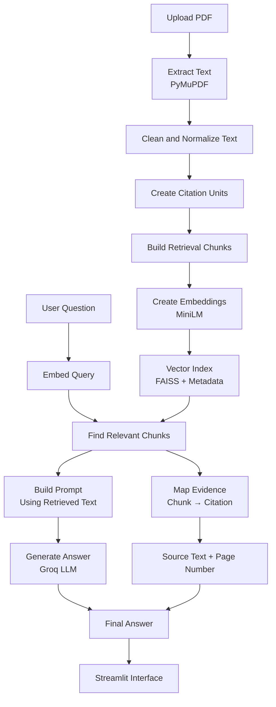

# Poppulo PDF RAG Demo

A Retrieval-Augmented Generation (RAG) system for asking questions about PDF documents.

The user uploads a PDF, the system indexes the document, and questions can be asked in natural language. Answers are generated using retrieved sections from the document, and the supporting source text is displayed.

**Live Demo:**  
Streamlit App: (https://poppulo-pdf-rag-hw5ngjh3dbdzfuex4jozvm.streamlit.app/)

## Recommended view

For the best layout:

- Use **Dark Mode**
- Set browser zoom to **75%**

This matches the layout and styling used during development.


## What This Project Does

This project demonstrates a document question-answering system built using a modular RAG pipeline.

Instead of letting the language model answer from its own knowledge, the system first retrieves relevant text from the uploaded document. The retrieved text is then used as context for the LLM to generate a grounded answer.

To improve transparency, the application also displays the exact source evidence used to support the answer, including the document name, page number, and supporting text.


## How It Works

The application follows a structured pipeline from document upload to answer generation.

1. A PDF document is uploaded through the Streamlit interface.
2. Text blocks are extracted using **PyMuPDF**.
3. Extracted text is cleaned and normalized.
4. Cleaned blocks are converted into **citation units** representing paragraph-level content.
5. Citation units are grouped into overlapping **retrieval chunks**.
6. Chunks are embedded using **sentence-transformers (all-MiniLM-L6-v2)**.
7. Embeddings are stored in a **FAISS vector index** together with metadata.
8. When the user asks a question:
   - the query is embedded
   - the most relevant chunks are retrieved
9. Retrieved context is used to construct a grounded prompt.
10. **Groq LLM** generates the final answer.
11. Retrieved chunks are mapped back to citation units to display the original supporting text.

This separation between answer generation and evidence mapping ensures that citations shown to the user come directly from retrieved document content rather than from the language model itself.


## System Architecture




## Project Structure

```
pdf_rag_app
│
├── app
│   └── main.py                # Streamlit UI
│
├── src
│   ├── pdf_parser.py          # PDF parsing using PyMuPDF
│   ├── text_cleaner.py        # Text normalization and filtering
│   ├── citation_builder.py    # Builds citation units
│   ├── chunker.py             # Creates retrieval chunks
│   ├── embedder.py            # Sentence-transformer embeddings
│   ├── retriever.py           # FAISS retrieval logic
│   ├── prompt_builder.py      # Prompt construction
│   ├── generator.py           # LLM provider wrapper
│   ├── index_store.py         # FAISS index + metadata persistence
│   ├── pipeline.py            # End-to-end indexing and QA pipeline
│   └── models.py              # Data structures
│
├── data
│   └── raw                    # Sample PDFs
│
├── requirements.txt
└── README.md
```
The codebase is organized so each stage of the pipeline is isolated in its own module.
This allows the indexing, retrieval, and generation components to remain independent and easier to extend.


## Evidence-Grounded Answers

The system emphasizes transparency by displaying supporting evidence alongside the generated answer.

Each answer includes:

- Source document name

- Page number

- Supporting text snippet

This information is mapped deterministically from retrieved chunk metadata rather than generated by the language model.

## Handling Edge Cases

Several validation checks are built into the pipeline to ensure stable behavior:

- PDFs with no extractable text

- empty parsing results

- failed embedding generation

- empty retrieval results

- mismatched index and metadata

- LLM provider failures

These checks prevent the application from returning misleading or unsupported answers.


## Deployment

The app is deployed on Streamlit Community Cloud using Groq for LLM inference.
If the app sleeps due to inactivity, clicking Wake App will restart it.

## Design Decisions

A few design choices guided the system architecture:

1. Citation-first processing

Citation units are created before chunking so that retrieved content can always be traced back to its original paragraph.

2. Metadata-backed retrieval

Vector search results are linked to stored metadata so the UI can display source evidence with document and page references.

3. Single active document retrieval

The interface allows multiple PDFs to be uploaded but restricts querying to one indexed document at a time. This avoids mixing information across documents and keeps retrieval results clear.

## Example Questions

- What is the main idea of this document?
- What problem does the paper solve?
- What methods are proposed?

## Future Improvements

- multi-document search
- PDF preview with highlighted evidence
- query history
- improved caching


