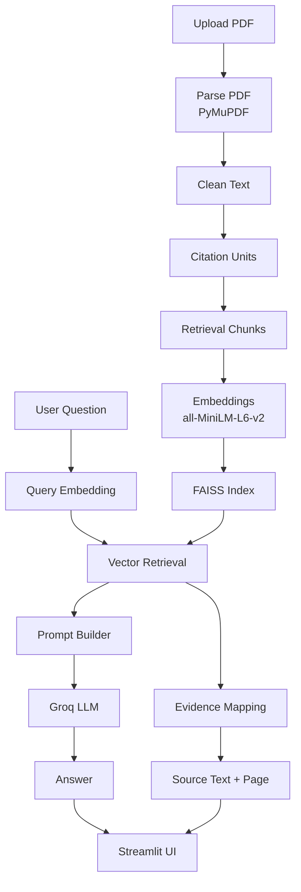

# Poppulo PDF RAG Demo

A simple Retrieval-Augmented Generation (RAG) system for asking questions about PDF documents.

The user uploads a PDF, the system indexes the document, and questions can be asked in natural language. Answers are generated using retrieved sections from the document, and the supporting source text is displayed.

**Live Demo:**  
(https://poppulo-pdf-rag-hw5ngjh3dbdzfuex4jozvm.streamlit.app/)


## Best Viewing Settings

For the best layout:

- Use **Dark Mode**
- Set browser zoom to **75%**

This matches the layout and styling used during development.


## What This Project Does

This project demonstrates a document question-answering system built using a modular RAG pipeline.

Instead of letting the language model answer from its own knowledge, the system first retrieves relevant text from the uploaded document. The retrieved text is then used as context for the LLM to generate a grounded answer.

The UI also displays the source document name, page number, and supporting text.


## How It Works

1. User uploads a PDF
2. Text is extracted using **PyMuPDF**
3. Text is cleaned and converted into citation units
4. Citation units are grouped into retrieval chunks
5. Chunks are embedded using **sentence-transformers**
6. Embeddings are stored in a **FAISS vector index**
7. When the user asks a question:
   - the query is embedded
   - the most relevant chunks are retrieved
8. Retrieved text is used to build a prompt
9. **Groq LLM** generates the answer
10. Supporting evidence is mapped and shown in the UI


## System Architecture




## Project Structure

```
pdf_rag_app
│
├── app
│   └── main.py                # Streamlit UI
│
├── src
│   ├── chunker.py             # Builds overlapping retrieval chunks
│   ├── citation_builder.py    # Builds citation units from cleaned text blocks
│   ├── config.py              # Configuration and paths
│   ├── embedder.py            # Sentence-transformer embedding logic
│   ├── generator.py           # Groq / Ollama generation wrapper
│   ├── index_store.py         # FAISS index + metadata persistence
│   ├── models.py              # Dataclasses for blocks, chunks, results
│   ├── pdf_parser.py          # PDF parsing with PyMuPDF
│   ├── pipeline.py            # End-to-end indexing and QA pipeline
│   ├── prompt_builder.py      # Strict grounded prompt construction
│   ├── retriever.py           # Top-k FAISS retrieval
│   └── text_cleaner.py        # Text normalization and noise filtering
│
├── data
│   └── raw                    # Sample/demo PDFs
│
├── requirements.txt
├── README.md
└── .gitignore
```

## Design Choices

1. Evidence Mapping

The system does not rely on the LLM to generate citations. Evidence is mapped in Python using retrieved chunk metadata.

2. Single Active Document

The UI allows multiple uploaded PDFs, but only one document is indexed and queried at a time. This avoids mixing information across documents.

3. Strict Prompting

The prompt instructs the model to answer only from retrieved context.


## Error Handling

The system includes checks for:

- empty PDFs
- parsing failures
- missing embeddings
- empty retrieval results
- LLM provider failures

User-friendly messages are shown in the UI.


## Deployment

The app is deployed on Streamlit Community Cloud using Groq for LLM inference.
If the app sleeps due to inactivity, clicking Wake App will restart it.


## Example Questions

- What is the main idea of this document?
- What problem does the paper solve?
- What methods are proposed?


## Future Improvements

- multi-document search
- PDF preview with highlighted evidence
- query history
- improved caching


